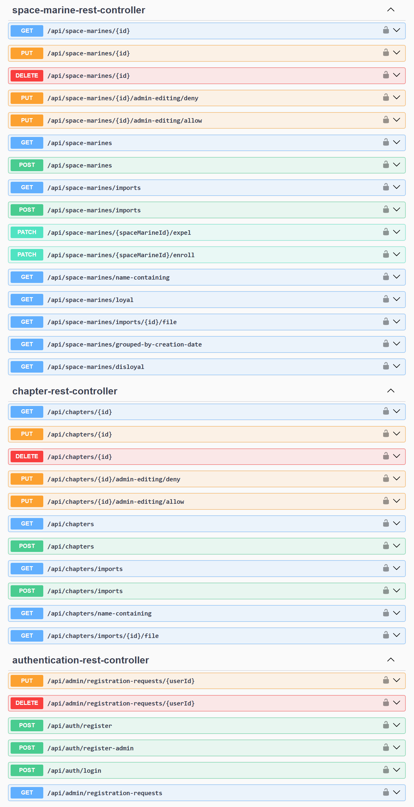

# Информационная система для учета космических десантников

## Технологии

**Spring**: Boot, Web, Data JPA, Security + JWT;

AWS S3, PostgreSQL, Docker, Swagger, Maven

## Функции системы

Система предназначена для управления космическими десантниками и орденами, в которых они состоят.

Пользователям доступны базовые операции:
создание, обновление, удаление объекта, получение объекта по ID, получение всех объектов.
Также пользователям доступны некоторые специальные операции.

При получении всех объектов доступны пагинация, сортировка и фильтрация объектов.
Фильтрация поддерживается только для строковых полей, по полному совпадению.

### Пользователи

Система поддерживает 2 роли пользователей: обычный пользователь и администратор.
Обычные пользователи могут свободно регистрироваться.
Если в системе уже создан хотя бы один администратор, зарегистрировать нового администратора можно 
только при одобрении одним из существующих администраторов.
После успешной регистрации пользователь получает возможность доступа к системе через JWT-токен.

При создании объекта сохраняется информация о его владельце.
Редактировать и удалять объекты могут только пользователи, которые их создали, и администраторы. 
Администраторы могут редактировать только те объекты, которые пользователь разрешил редактировать администраторам.
Пользователь может отзывать и добавлять право на редактирование объекта администраторами.

### Массовый импорт

Система поддерживает массовый импорт объектов из файла.
Формат файла - JSON: список из обычных запросов на создание объекта.

На уровне бизнес-логики реализовано ограничение уникальности имен объектов (по ТЗ ограничение необходимо именно на уровне бизнес-логики).
Если в файле есть объекты, которые нарушают это ограничение, ни один объект из файла не сохраняется.

История импортов (успешных и неуспешных) сохраняется.
Файлы, объекты из которых успешно импортированы, сохраняются в S3 (Yandex Object Storage) и доступны пользователям для скачивания.

**Система поддерживает согласованность данных** при отказе отдельных ее частей (БД, бэкенд, S3), 
а также при попытке параллельного импорта или создания/изменения/удаления объектов.
Корректность изоляции транзакций протестирована с помощью JMeter 
(реализован сценарий нагрузочного тестирования, эмитирующий работу нескольких пользователей).

## API

### Swagger
